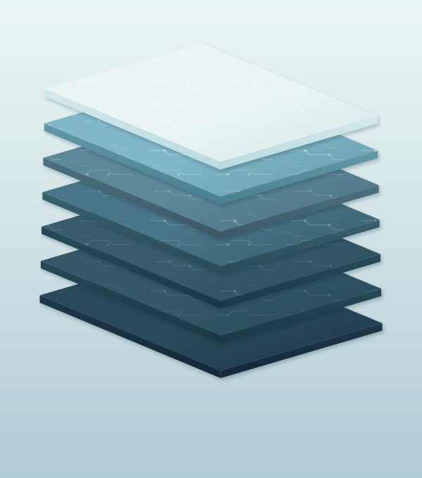

# 计算机系统通识 {.unnumbered}

```{=html}
<a href="src/preface.html" class="cover-link" title="翻开本书">
  
  <span class="cover-hint">点击翻开 →</span>
</a>
<script>document.getElementById('title-block-header').addEventListener('click',function(){location.href='src/preface.html'})</script>
<style>
#title-block-header {
  position: relative;
  background-color: #eaf4f5;
  margin: 0 !important;
  padding: 0 !important;
  overflow: hidden;
  cursor: pointer;
  transition: transform 0.4s ease, box-shadow 0.4s ease, background-color 0.4s ease;
}
.content {
  perspective: 1000px;
}
section.level1.unnumbered {
  transform-style: preserve-3d;
}
#title-block-header:hover,
.content:has(.cover-link:hover) #title-block-header,
#title-block-header:hover ~ section .cover-link,
.content:has(#title-block-header:hover) .cover-link {
  transform: rotateY(-1.5deg) scale(1.008);
}
.cover-link {
  position: relative;
  display: block;
  text-decoration: none;
  margin: 0 auto;
  width: 100%;
  transition: transform 0.4s ease, box-shadow 0.4s ease, opacity 0.3s ease;
}
.cover-link:hover {
  transform: rotateY(-1.5deg) scale(1.008);
}
.cover-svg {
  display: block;
  width: 100%;
}
.cover-hint {
  position: absolute;
  bottom: 45%;
  right: 2rem;
  color: rgba(255,255,255,0.7);
  text-shadow: 0 1px 3px rgba(0,0,0,0.25);
  font-size: 0.8rem;
  letter-spacing: 0.06em;
  pointer-events: none;
}
.quarto-title {
  text-align: center;
  padding: 1rem 2rem 0;
}
.quarto-title h1.title {
  color: #1a3040;
  font-size: 2.4rem;
  font-weight: 700;
  text-shadow: 0 2px 8px rgba(255,255,255,0.9), 0 1px 3px rgba(0,0,0,0.15);
  margin-bottom: 0.5rem;
}
.quarto-title p.subtitle {
  color: #2a4a5a;
  font-size: 1.05rem;
  font-weight: 400;
  text-shadow: 0 1px 4px rgba(255,255,255,0.85);
  margin: 0;
}
.quarto-title-meta {
  background: transparent;
  padding: 0.8rem 2rem 1.5rem !important;
  display: flex;
  justify-content: center;
  gap: 2.5rem;
}
.quarto-title-meta > div {
  display: flex;
  align-items: baseline;
  gap: 0.4rem;
}
.quarto-title-meta-heading {
  color: rgba(26,48,64,0.45) !important;
  font-size: 0.78rem;
  font-weight: 400;
  letter-spacing: 0.04em;
}
.quarto-title-meta-contents {
  margin: 0 !important;
  padding: 0 !important;
}
.quarto-title-meta-contents p {
  color: #2a4a5a !important;
  font-size: 0.88rem;
  margin: 0;
  font-weight: 500;
}
</style>
```