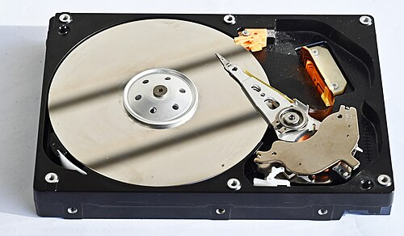

## 存储层次结构 {#sec-memory-hierarchy}

::: {.callout-note}
### 本章概览

**本章内容**：存储层次结构如何在局部性原理的支撑下化解速度容量成本不可兼得的矛盾

**前置知识**：理解寄存器是 CPU 内部的高速存储单元，主存放正在运行的程序和数据，冯·诺依曼体系结构中程序和数据存放在同一存储器中
:::

---

### 为什么需要多层存储

CPU 的运算速度和存储器的速度之间相差数个数量级。现代 CPU 每秒可执行数十亿条指令，每条指令需要从存储器中读取数据。如果每次读取都要等存储器响应，CPU 大部分时间在等待而不是在计算。

理想情况下，存储器应同时满足三个要求：**速度快**（跟上 CPU）、**容量大**（装下所有程序和数据）、**价格低**（可以大量部署）。但这三个要求互相矛盾：

- 速度快的存储器，每位成本高，容量做不大
- 容量大的存储器，每位成本低，速度做不快
- 价格低的存储器，通常速度慢、容量大

没有任何一种存储技术能同时满足这三个要求。解决方案不是寻找一种"完美"的存储器，而是**用多种存储器组成层次结构**：速度最快、容量最小的在最上层，速度最慢、容量最大的在最下层。上层存储器作为下层存储器的缓存，存放最常使用的数据。

### 什么是权衡 {#sec-tradeoff}

上一节的矛盾值得停下来看一眼：面对这三个要求，**多个目标都想要，却不可兼得——只能放弃一些来换取另一些。**这种选择就叫做**权衡**（trade-off）。

权衡不是在好与坏之间选：快、大、便宜，哪个都是合理的目标，它们只是互相冲突。权衡也没有标准答案，只有给定条件下的合适选择；条件一变，选择就变。

你在 @sec-digital-representation 已经见过一次：压缩在细节保真与传输效率之间权衡，怎么选取决于应用场景。本章接下来逐层介绍每一种存储器，可以带着一个问题读：它保住了什么，放弃了什么？

后文还会遇到同类权衡。后文再出现"权衡"一词时，指的都是这里定义的含义。

### 存储金字塔

计算机的存储层次从上到下形成一个金字塔结构：

::: {#fig-memory-hierarchy}

~1 KB寄存器 SRAM · 触发器0.3 ns

~64 KBL1 缓存 SRAM · 核心私有1 ns

~512 KBL2 缓存 SRAM · 通常核心私有3 ns

~8 MBL3 缓存 SRAM · 全核共享10 ns

~16 GB主存 DRAM · 易失100 ns

~1 TBSSD NAND Flash · 非易失10 μs

~10 TBHDD 磁记录 · 非易失5 ms

~PB远程存储 网络 · 非易失10 ms

↓ 容量递增&emsp;·&emsp;访问时间递增

存储层次金字塔
:::

| 层级 | 存储器 | 典型容量 | 典型访问时间 | 是否易失 |
|------|--------|---------|-------------|---------|
| 1 | 寄存器 | 32 B--2 KB | 0.3 ns | 是 |
| 2 | L1 缓存 | 32--64 KB | 1 ns | 是 |
| 3 | L2 缓存 | 256 KB--1 MB | 3--10 ns | 是 |
| 4 | L3 缓存 | 4--64 MB | 10--30 ns | 是 |
| 5 | 主存（DRAM） | 8--128 GB | 50--100 ns | 是 |
| 6 | 固态硬盘（SSD） | 256 GB--4 TB | 10--100 μs | 否 |
| 7 | 机械硬盘（HDD） | 1--20 TB | 5--10 ms | 否 |
| 8 | 远程存储（网络） | PB 级以上（1 PB = 1000 TB） | 10--100 ms | 否 |

"是否易失"指断电后数据是否丢失。易失性存储器（寄存器、缓存、主存）断电后数据消失，非易失性存储器（SSD、HDD）断电后数据保留。

从寄存器到远程存储，访问时间相差约 9 个数量级（从 0.3 ns 到 100 ms），容量相差约 13 个数量级（从数十字节到 PB 级）。相邻层的速度差异从 3 倍（寄存器→L1）到数百倍（SSD→HDD）不等，但总体趋势是越往下越慢、容量越大、每位价格越低。

这个层次结构之所以有效，依赖于一个关键事实：**程序访问数据时，不是均匀地访问所有数据，而是集中在少数数据上**。这就是局部性原理。

### 局部性原理

**局部性原理**（principle of locality）是存储层次结构有效运作的基础。它描述了程序在时间上的两种访问倾向：

**时间局部性**（temporal locality）：如果一个数据刚被访问过，那么它在近期很可能再次被访问。例如，循环中的计数器变量在每次迭代中都会被读取和修改，在短时间内被反复访问。

**空间局部性**（spatial locality）：如果一个数据刚被访问过，那么与它地址相邻的数据很可能在近期也会被访问。例如，数组元素在内存中连续存放，遍历数组时访问的是相邻地址；指令在内存中顺序存放，CPU 顺序执行时访问的也是相邻地址。

局部性不是程序必须遵守的规则，而是大多数程序表现出的统计规律。但正是这个规律，使得缓存策略有效：把最近使用过的数据留在上层存储器（利用时间局部性），把与最近使用过的数据相邻的数据也预取到上层存储器（利用空间局部性），就能让 CPU 大部分时候在上层存储器中找到需要的数据，而不必等待慢速的下层存储器。

典型程序中，90% 以上的数据访问可以在 L1 和 L2 缓存中命中，只有不到 10% 的访问需要到主存或更慢的存储器。这意味着虽然主存的访问时间是 50--100 ns，但 CPU 感受到的平均访问时间接近 L1 缓存的 1 ns。

### 缓存的工作原理

局部性原理告诉我们"数据访问有倾向性"，缓存就是利用这种倾向性的具体机制。L1 缓存缓存 L2 的数据，L2 缓存缓存 L3 的数据，L3 缓存缓存主存的数据，主存可以看作磁盘的缓存——每一层都缓存下一层的数据，形成一条缓存链。

#### 缓存命中与缺失

当 CPU 需要读取数据时，先在 L1 缓存中查找：

- **缓存命中**（cache hit）：数据在缓存中，直接读取。命中时，访问时间等于缓存的访问时间（约 1 ns）
- **缓存缺失**（cache miss）：数据不在缓存中，需要到下一层存储器中读取。缺失时，访问时间等于下一层的访问时间加上将数据调入缓存的时间

缓存的性能取决于**命中率**（hit rate）——访问数据时在缓存中命中的比例。命中率越高，平均访问时间越接近缓存的速度。L1 缓存的命中率通常在 90%--95% 之间，L2 缓存在 95% 以上，具体取决于程序的局部性和缓存的大小。

#### 缓存行

缓存不是以单个字节为单位存储数据的，而是以**缓存行**（cache line，也叫缓存块 cache block）为单位。典型的缓存行大小为 64 字节。

以缓存行为单位传输数据有两个好处：

1. **利用空间局部性**：一次把 64 个相邻字节一起调入缓存，如果程序接下来访问相邻地址的数据，数据已经在缓存中了
2. **减少管理开销**：每条缓存行只需要一份地址标签和管理信息，如果以字节为单位管理，管理信息的总量会接近数据本身

#### 地址映射

缓存行的数量比主存块数少多个数量级，多个主存块会映射到同一个缓存行位置。如何建立主存地址和缓存位置的对应关系，叫做**地址映射**。常见的映射方式有三种：

**直接映射**（direct mapping）：每个主存块只能放在缓存中的一个固定位置。映射规则简单，查找速度快，但不同主存块如果映射到同一位置会互相驱逐，即使缓存中还有其他空位。

**全相联映射**（fully associative mapping）：主存块可以放在缓存中的任意位置。灵活性最高，冲突最少，但查找时需要与所有缓存行比较标签，硬件复杂度高。

**组相联映射**（set-associative mapping）：折中方案。缓存分成若干组，每组包含 N 条缓存行（称为 N 路组相联）。主存块映射到固定组，但在组内可以放在任意行。N 通常为 2、4、8。现代 CPU 的 L1 缓存通常采用 4 路或 8 路组相联。

用一个具体例子说明三者的区别：假设缓存有 4 条缓存行，主存有 16 个块（编号 0--15）。

| 映射方式 | 主存块 0 可放的缓存行 | 主存块 4 可放的缓存行 | 冲突情况 |
|---------|-------------------|-------------------|---------|
| 直接映射 | 仅行 0 | 仅行 0 | 块 0 和块 4 必须抢行 0，即使行 1--3 空闲 |
| 全相联映射 | 任意行 | 任意行 | 无冲突，但查找需比较 4 条标签 |
| 2 路组相联 | 组 0 内的任意行（行 0 或行 1） | 组 0 内的任意行（行 0 或行 1） | 组内 2 路可缓解冲突，查找只比较 2 条标签 |

#### 替换策略

缓存满了之后，新数据需要替换旧数据。替换哪个缓存行，叫做**替换策略**：

- **LRU**（Least Recently Used，最近最少使用）：替换最久没有被访问的缓存行。LRU 利用了时间局部性——最近使用的数据很可能还会再用，最久没用的数据被再次使用的概率最低。在不需要未来访问信息的策略中，LRU 的效果最好，但记录访问顺序需要额外硬件，N 路组相联中 N 较大时实现成本较高
- **随机替换**：随机选一个缓存行替换。实现简单，实际效果在大多数情况下接近 LRU

#### 写入策略

读取时缓存缺失，只需从下层调入数据。写入时的问题更复杂：修改了缓存中的数据，下层存储器中的副本还是旧值。如何保持缓存和下层存储器的一致性，叫做**写入策略**：

- **写直达**（write-through）：同时写入缓存和下层存储器。数据始终一致，但每次写入都要访问下层存储器，速度慢
- **写回**（write-back）：只写入缓存，标记该缓存行为"脏"（dirty，即已修改）。当脏行被替换出缓存时，才将修改后的数据写回下层存储器。写入速度快，但替换时需要额外一次写回操作，且在替换前缓存和下层存储器中的数据不一致

现代 CPU 的 L1 和 L2 缓存通常使用写回策略，以减少写入延迟；L3 缓存视设计而定。

### 主存：DRAM

缓存解决了"CPU 等待慢速存储器"的问题，但缓存容量有限，程序的大部分数据还是存放在主存中。CPU 不能直接从磁盘读取数据——磁盘的访问时间是毫秒级，如果 CPU 每次取指令都要等磁盘，一条指令要等上百万个时钟周期。主存作为缓存和磁盘之间的中间层，用纳秒级的访问时间弥补了这个差距。

主存（main memory）使用**动态随机存取存储器**（Dynamic Random Access Memory，DRAM）芯片实现，存放正在运行的程序代码和数据。

#### DRAM 的存储原理

DRAM 的每个存储单元由一个**电容**（capacitor，一种能存储电荷的电子元件）和一个**晶体管**组成。电容充电表示 1，放电表示 0。之所以叫"动态"，是因为电容会漏电——即使不读写，存储的电荷也会在数十毫秒内逐渐流失。如果不定期补充电荷，数据就会丢失。

因此，DRAM 控制器必须周期性地读取每个单元的数据并重新写入，这个操作叫做**刷新**（refresh）。典型的 DRAM 每隔 64 ms 需要刷新一次所有单元。刷新期间 DRAM 无法响应读写请求，这段时间 CPU 需要等待。

与 DRAM 相对的是**静态随机存取存储器**（Static Random Access Memory，SRAM），用于 CPU 缓存。SRAM 的每个存储单元用 6 个晶体管构成一个双稳态触发器，不需要刷新，访问时间约 0.3--1 ns，但每位面积约为 DRAM 的 6 倍、成本约为 DRAM 的 100 倍以上。SRAM 只用于小容量的缓存（KB 级），大容量的主存使用 DRAM（GB 级）。

:::: {#fig-dram-sram-cell}

DRAM 存储单元

<svg viewBox="0 0 130 130" width="190" height="190" xmlns="http://www.w3.org/2000/svg">
<line x1="65" y1="0" x2="65" y2="22" stroke="#888" stroke-width="1.5"/>
<text x="78" y="10" font-size="9" fill="#888">位线</text>
<line x1="65" y1="22" x2="65" y2="54" stroke="#4477aa" stroke-width="2"/>
<line x1="20" y1="38" x2="62" y2="38" stroke="#4477aa" stroke-width="1.5"/>
<line x1="62" y1="33" x2="62" y2="43" stroke="#4477aa" stroke-width="1.5"/>
<text x="6" y="34" font-size="9" fill="#888">字线</text>
<line x1="65" y1="54" x2="65" y2="68" stroke="#888" stroke-width="1.5"/>
<line x1="45" y1="68" x2="85" y2="68" stroke="#4477aa" stroke-width="2.5"/>
<line x1="45" y1="78" x2="85" y2="78" stroke="#4477aa" stroke-width="2.5"/>
<text x="95" y="76" font-size="10" fill="#4477aa" font-weight="600">电容</text>
<line x1="65" y1="78" x2="65" y2="94" stroke="#888" stroke-width="1.5"/>
<line x1="53" y1="94" x2="77" y2="94" stroke="#888" stroke-width="1.5"/>
<line x1="57" y1="99" x2="73" y2="99" stroke="#888" stroke-width="1.2"/>
<line x1="61" y1="104" x2="69" y2="104" stroke="#888" stroke-width="1"/>
<text x="78" y="42" font-size="10" fill="#4477aa" font-weight="600">晶体管</text>
<text x="65" y="124" text-anchor="middle" font-size="12" fill="#4477aa" font-weight="700">1T + 1C</text>
</svg>

动态 需刷新&emsp;面积 1×&emsp;成本 1×

SRAM 存储单元

<svg viewBox="0 0 240 220" width="300" height="275" xmlns="http://www.w3.org/2000/svg">
<line x1="15" y1="25" x2="225" y2="25" stroke="#333" stroke-width="2"/>
<text x="120" y="18" text-anchor="middle" font-size="12" fill="#333" font-weight="700">WL（字线）</text>
<line x1="40" y1="15" x2="40" y2="175" stroke="#333" stroke-width="2"/>
<text x="22" y="105" text-anchor="middle" font-size="11" fill="#333" font-weight="600" transform="rotate(-90,22,105)">BL（位线）</text>
<line x1="200" y1="15" x2="200" y2="175" stroke="#333" stroke-width="2"/>
<text x="218" y="105" text-anchor="middle" font-size="11" fill="#333" font-weight="600" transform="rotate(90,218,105)">BL̄（位线反相）</text>
<line x1="110" y1="46" x2="130" y2="46" stroke="#333" stroke-width="2"/>
<line x1="120" y1="46" x2="120" y2="52" stroke="#333" stroke-width="2"/>
<line x1="80" y1="52" x2="160" y2="52" stroke="#333" stroke-width="2"/>
<text x="120" y="42" text-anchor="middle" font-size="11" fill="#333" font-weight="700">VDD</text>
<line x1="80" y1="185" x2="160" y2="185" stroke="#333" stroke-width="2"/>
<line x1="120" y1="185" x2="120" y2="200" stroke="#333" stroke-width="2"/>
<line x1="104" y1="200" x2="136" y2="200" stroke="#333" stroke-width="2"/>
<line x1="110" y1="205" x2="130" y2="205" stroke="#333" stroke-width="1.5"/>
<line x1="115" y1="209" x2="125" y2="209" stroke="#333" stroke-width="1"/>
<circle cx="80" cy="115" r="4" fill="#e65100"/>
<text x="80" y="106" text-anchor="middle" font-size="14" fill="#e65100" font-weight="700">Q</text>
<line x1="80" y1="115" x2="135" y2="115" stroke="#e65100" stroke-width="1.5"/>
<circle cx="135" cy="115" r="3" fill="#e65100"/>
<circle cx="160" cy="115" r="4" fill="#e65100"/>
<text x="160" y="106" text-anchor="middle" font-size="14" fill="#e65100" font-weight="700">Q̄</text>
<line x1="160" y1="120" x2="105" y2="120" stroke="#e65100" stroke-width="1.5"/>
<circle cx="105" cy="120" r="3" fill="#e65100"/>
<line x1="80" y1="52" x2="80" y2="85" stroke="#e65100" stroke-width="2.5"/>
<polyline points="85,70 105,70 105,162 85,162" fill="none" stroke="#e65100" stroke-width="1.5"/>
<circle cx="85" cy="70" r="3" fill="#fff" stroke="#e65100" stroke-width="1.5"/>
<line x1="85" y1="63" x2="85" y2="67" stroke="#e65100" stroke-width="2"/>
<line x1="85" y1="73" x2="85" y2="77" stroke="#e65100" stroke-width="2"/>
<text x="72" y="64" font-size="11" fill="#e65100" font-weight="700" text-anchor="end">P1</text>
<line x1="80" y1="85" x2="80" y2="111" stroke="#666" stroke-width="1.5"/>
<line x1="160" y1="52" x2="160" y2="85" stroke="#e65100" stroke-width="2.5"/>
<polyline points="155,70 135,70 135,162 155,162" fill="none" stroke="#e65100" stroke-width="1.5"/>
<circle cx="155" cy="70" r="3" fill="#fff" stroke="#e65100" stroke-width="1.5"/>
<line x1="155" y1="63" x2="155" y2="67" stroke="#e65100" stroke-width="2"/>
<line x1="155" y1="73" x2="155" y2="77" stroke="#e65100" stroke-width="2"/>
<text x="168" y="64" font-size="11" fill="#e65100" font-weight="700">P2</text>
<line x1="160" y1="85" x2="160" y2="111" stroke="#666" stroke-width="1.5"/>
<line x1="40" y1="115" x2="76" y2="115" stroke="#e65100" stroke-width="2.5"/>
<line x1="58" y1="25" x2="58" y2="111" stroke="#e65100" stroke-width="1.8"/>
<circle cx="58" cy="25" r="3" fill="#e65100"/>
<line x1="51" y1="111" x2="65" y2="111" stroke="#e65100" stroke-width="2"/>
<text x="58" y="106" text-anchor="middle" font-size="12" fill="#e65100" font-weight="700">N3</text>
<line x1="164" y1="115" x2="200" y2="115" stroke="#e65100" stroke-width="2.5"/>
<line x1="182" y1="25" x2="182" y2="111" stroke="#e65100" stroke-width="1.8"/>
<circle cx="182" cy="25" r="3" fill="#e65100"/>
<line x1="175" y1="111" x2="189" y2="111" stroke="#e65100" stroke-width="2"/>
<text x="182" y="106" text-anchor="middle" font-size="12" fill="#e65100" font-weight="700">N4</text>
<line x1="80" y1="145" x2="80" y2="178" stroke="#e65100" stroke-width="2.5"/>
<line x1="85" y1="155" x2="85" y2="169" stroke="#e65100" stroke-width="2"/>
<text x="66" y="158" font-size="12" fill="#e65100" font-weight="700" text-anchor="end">N1</text>
<line x1="80" y1="145" x2="80" y2="119" stroke="#666" stroke-width="1.5"/>
<line x1="80" y1="178" x2="80" y2="185" stroke="#666" stroke-width="1.5"/>
<line x1="160" y1="145" x2="160" y2="178" stroke="#e65100" stroke-width="2.5"/>
<line x1="155" y1="155" x2="155" y2="169" stroke="#e65100" stroke-width="2"/>
<text x="174" y="158" font-size="12" fill="#e65100" font-weight="700">N2</text>
<line x1="160" y1="145" x2="160" y2="119" stroke="#666" stroke-width="1.5"/>
<line x1="160" y1="178" x2="160" y2="185" stroke="#666" stroke-width="1.5"/>
<text x="120" y="222" text-anchor="middle" font-size="15" fill="#e65100" font-weight="700">6T 触发器</text>
</svg>

静态 不需刷新&emsp;面积 ~6×&emsp;成本 ~100×

DRAM 与 SRAM 存储单元对比
::::

#### DRAM 的性能

DRAM 的访问时间约 50--100 ns，但这个时间不是固定的。DRAM 的内部结构是行×列的矩阵，访问一个单元需要先发送行地址（RAS，Row Access Strobe），再发送列地址（CAS，Column Access Strobe）。连续访问同一行的不同列时，不需要重新发送行地址，速度更快。DDR（Double Data Rate）系列进一步提升了传输效率：它在每个时钟周期的上升沿和下降沿各传输一次数据，一个周期传输两次。

当前主流的 DRAM 标准：

| 标准 | 代际 | 典型频率 | 峰值带宽（双通道） |
|------|------|---------|------------------|
| DDR3 | 第 3 代 | 800--1600 MHz | 12.8--25.6 GB/s |
| DDR4 | 第 4 代 | 1600--3200 MHz | 25.6--51.2 GB/s |
| DDR5 | 第 5 代 | 3200--6400 MHz | 51.2--102.4 GB/s |

### 固态硬盘：SSD

主存虽然比磁盘快，但断电后数据丢失——关机后程序和数据必须保存在非易失性存储器中。在 SSD 出现之前，这个角色由机械硬盘承担，但机械硬盘的随机访问需要等待磁头移动（毫秒级），成为系统启动和程序加载的瓶颈。SSD 用闪存芯片替代了机械结构，将随机访问延迟从毫秒级降到了微秒级。

固态硬盘（Solid State Drive，SSD）使用**闪存**（flash memory）芯片存储数据，没有机械部件。

#### 闪存的存储原理

闪存的每个存储单元是一个**浮栅晶体管**（一种特殊的 MOS 晶体管，栅极被绝缘层包围，电荷可以长期保存在浮栅中而不流失）。闪存是非易失性存储器——断电后数据不丢失。

闪存有四种类型，按每个存储单元存储的比特数区分：

- **SLC**（Single-Level Cell）：每单元 1 bit，擦写寿命约 10 万次，速度最快，成本最高，用于企业级 SSD
- **MLC**（Multi-Level Cell）：每单元 2 bit，擦写寿命约 3000--10000 次，成本适中，用于消费级 SSD
- **TLC**（Triple-Level Cell）：每单元 3 bit，擦写寿命约 500--3000 次，成本最低，目前消费级 SSD 的主流
- **QLC**（Quad-Level Cell）：每单元 4 bit，擦写寿命约 100--1000 次，每位成本最低，用于大容量存储

每单元存储的比特数越多，区分的电平数越多，可靠性越低，寿命越短，但每位成本越低。

#### 擦写限制与磨损均衡

闪存有一个独特的限制：**擦写次数有限**。每个存储块在擦写一定次数后，绝缘层会老化，无法可靠地保存电荷。DRAM 没有擦写次数限制（可以无限读写），机械硬盘的磁介质也没有擦写次数限制，闪存是三者中唯一有此限制的。

为了应对擦写限制，SSD 控制器使用**磨损均衡**（wear leveling）算法：将写入操作均匀地分散到所有存储块上，避免某些块被频繁擦写而过早失效。SSD 内部还有**预留空间**（over-provisioning），保留一部分存储块不暴露给操作系统，用于替换失效的块。

SSD 的标称寿命通常用 **TBW**（Terabytes Written）表示，即在保修期内可以写入的总数据量。例如一块 1 TB 的消费级 SSD，TBW 可能为 600 TB——对于日常使用（每天写入 20--50 GB），600 TB ÷ 30 GB/天 ≈ 20000 天，足够使用数十年。

#### SSD 的性能

SSD 的随机读写延迟约 10--100 μs，比机械硬盘快 50--100 倍。顺序读写带宽可达 3--7 GB/s（NVMe 接口）。SSD 的性能优势主要体现在随机 I/O 上——机械硬盘的随机读写需要寻道，SSD 没有机械部件，随机访问和顺序访问的速度差距小得多。

### 机械硬盘：HDD

SSD 在速度上全面超越机械硬盘，但每 GB 成本仍高于机械硬盘。对于需要存储大量数据但对随机访问速度要求不高的场景（监控录像、数据备份、冷存储），机械硬盘仍有成本优势。

机械硬盘（Hard Disk Drive，HDD）使用磁性材料存储数据，通过旋转的盘片和移动的磁头读写数据。

#### HDD 的结构

{#fig-hdd-structure}

机械硬盘的主要部件：

- **盘片**（platter）：涂有磁性材料的圆形盘片，数据记录在盘片表面的磁道上。盘片以恒定速度旋转，典型转速为 5400 RPM 或 7200 RPM（每分钟转数）
- **磁头**（head）：悬浮在盘片表面的读写头，每个盘面有一个磁头。磁头通过摇臂在盘片上径向移动，定位到目标磁道
- **主轴电机**：驱动盘片旋转
- **摇臂电机**：驱动磁头移动

#### HDD 的访问过程

读取一个数据块需要三个步骤：

1. **寻道**（seek）：磁头移动到目标磁道上方。寻道时间是机械硬盘最大的性能瓶颈，典型值为 3--9 ms
2. **旋转等待**（rotational latency）：等待目标扇区旋转到磁头下方。平均旋转等待时间为盘片旋转半周的时间：7200 RPM 的硬盘，平均旋转等待约 4.2 ms
3. **数据传输**（transfer）：磁头读取扇区数据。传输时间通常远小于寻道和旋转等待

一次随机访问的总时间约 5--10 ms，其中机械运动（寻道 + 旋转等待）占 90% 以上。机械硬盘随机性能受制于机械运动——每次访问都要等待磁头移动和盘片旋转。

顺序读写时，磁头不需要频繁寻道，数据传输速率可以达到 100--200 MB/s。因此，机械硬盘在顺序大文件读写场景下可以满足需求，但在随机读写场景下远不如 SSD。

#### HDD 的现状

机械硬盘在消费级市场已被 SSD 大量替代，但在大容量存储场景（数据中心冷存储、监控录像存储、备份归档）中仍有优势：每 GB 成本低于 SSD，单盘容量可达 20 TB 以上。

### 虚拟内存：用磁盘扩展主存

存储层次结构到磁盘似乎已经结束，但操作系统在主存和磁盘之间又加了一层**软件实现的缓存**：**虚拟内存**（virtual memory）。

当主存容量不足以容纳所有正在运行的程序和数据时，操作系统把一部分数据暂时移到磁盘上，只把当前需要的数据留在主存中。磁盘上用于存放这部分数据的区域叫做**交换区**（swap space）或**页面文件**（page file）。

虚拟内存的运作方式与缓存类似：

- 主存中存放的数据块叫做**页**（page），通常大小为 4 KB
- CPU 访问一个地址时，先查找该地址所在的页是否在主存中
- 如果在主存中（**页命中**），直接访问
- 如果不在主存中（**页缺失**，page fault），操作系统从磁盘读取该页到主存，然后重新执行访问指令

页缺失的代价远大于缓存缺失：磁盘访问需要 5--10 ms（HDD）或 10--100 μs（SSD），而 L1 缓存缺失只需 3--10 ns。一次页缺失相当于数百万条指令的执行时间。因此，操作系统的页面置换算法（决定把哪个页移出主存）比缓存的替换策略更重要——选错页面的代价是数百万条指令的等待时间。@sec-memory-management 会详细讲解虚拟内存的管理机制。

### 本章小结

存储层次结构是解决"速度、容量、成本"三者矛盾的方案：用多种存储器组成金字塔，上层快而小，下层慢而大，每一层缓存下一层的数据。局部性原理是层次结构有效运作的基础——程序倾向于反复访问最近使用过的数据（时间局部性）和相邻地址的数据（空间局部性），使得缓存命中率可以达到 90% 以上。缓存以缓存行为单位传输数据，通过地址映射、替换策略和写入策略管理数据的一致性。主存使用 DRAM，需要定期刷新；固态硬盘使用闪存，有擦写次数限制但无机械部件；机械硬盘依赖磁头寻道，随机性能受制于机械运动。虚拟内存用磁盘扩展主存，是操作系统在存储层次结构上的软件补充。从缓存到磁盘，每一种存储器都是权衡的结果，后文会反复遇到这个词。

::: {.callout-note}
### 在生活中

你电脑的"内存"和"硬盘"是两个不同的东西——内存是运行程序的临时空间，关机后清空；硬盘是永久存储，关机后数据还在。买电脑时销售说"内存 16GB，硬盘 512GB"，指的是两种不同的存储。
:::

::: {.callout-tip}
### 延伸阅读

- Randal E. Bryant & David R. O'Hallaron《深入理解计算机系统》第 6 章 —— 从程序员视角深入讲解存储层次结构与缓存机制
- David A. Patterson & John L. Hennessy《Computer Organization and Design》第 5 章 —— 存储器层次结构的硬件设计视角
:::