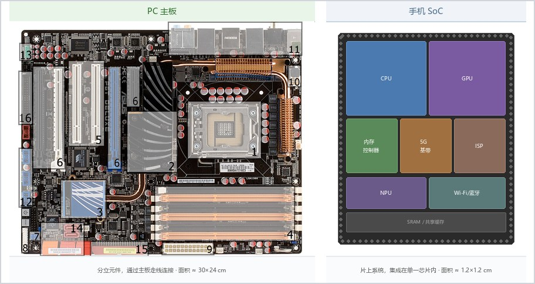

## 计算机的多样性 {#sec-computer-diversity}

::: {.callout-note}
### 本章概览

**本章内容**：不同形态的计算机如何在性能功耗成本不可兼得的约束下选择各自的取舍

**前置知识**：理解不同 CPU 使用不同指令集，存储器按速度和容量分为多个层次，CPU 的核心数、主频和功耗之间存在权衡
:::

---

### 为什么计算机不只有一种形态

前面几章讲了计算机的通用组成部分：CPU 执行指令，存储器保存数据，总线连接各个部件，外设负责输入输出。如果所有计算机都遵循同一套体系结构原理，为什么会有手机、笔记本、服务器、超级计算机等不同形态？为什么不能把手机芯片直接放进服务器？

原因在于**设计取舍**（design trade-off）。计算机设计没有单一最优解——每个设计决策都同时带来好处和代价。三个核心维度的取舍决定了计算机的形态：

| 维度 | 提升它的代价 | 典型取舍 |
|------|-------------|---------|
| 性能 | 功耗增加、发热增加 | 服务器追求性能，接受高功耗；手机牺牲峰值性能，换取长续航 |
| 功耗 | 性能下降 | 手机芯片限制在几瓦，服务器芯片可达数百瓦 |
| 成本 | 性能或可靠性下降 | 消费级产品用普通内存，服务器用 ECC 内存 |

这三个维度像三角形的三个顶点：你只能靠近其中两个，第三个会离你远去。手机靠近"低功耗"和"低成本"，远离"高性能"。服务器靠近"高性能"和"高可靠性"，远离"低成本"。不存在同时便宜、省电、性能强的计算机。

这个三角形的比喻局限在于：它暗示三者是零和博弈，但技术进步（如制程升级）可以让整个三角形向外扩张——今天的手机芯片比二十年前的服务器芯片便宜、省电、性能强。取舍关系在同一代技术内部成立，跨代比较时三角形整体在移动。

以下五类计算机形态，代表了在不同取舍方案下的典型设计。

### 嵌入式系统：藏在设备里的计算机

微波炉加热食物、汽车防抱死刹车、路由器转发数据包——这些设备里都有计算机，但你不会称它们为"电脑"。这类藏在设备内部、执行特定功能的计算机叫**嵌入式系统**（embedded system）。

嵌入式系统的设计取舍偏向低功耗和低成本：

- **资源受限**：嵌入式 CPU 的主频通常在数十 MHz 到数百 MHz（而手机 CPU 是 GHz 级别），内存可能只有几十 KB 到几 MB。不是做不到更高，而是不需要——微波炉只需要控制加热时间和功率，不需要运行浏览器。
- **实时性**（real-time）：某些嵌入式系统必须在规定时间内响应。汽车的安全气囊控制器从检测碰撞到弹出气囊，时间窗口只有几十毫秒。如果 CPU 因为处理其他任务而延迟，后果是气囊晚弹出——这种系统叫**硬实时系统**（hard real-time system），延迟意味着功能失效。与之相对的是**软实时系统**（soft real-time system），偶尔超时可以接受——视频播放掉了一帧，画面卡一下但还能继续看。
- **专用操作系统**：嵌入式系统通常不运行 Windows 或 Linux，而是运行**实时操作系统**（RTOS，Real-Time Operating System），甚至不跑操作系统，直接在裸机上执行一个程序循环（叫"裸机程序"或"固件"）。RTOS 的内核只有几 KB 到几十 KB，对比 Windows 内核的数百 MB，差距约 4 个数量级。

嵌入式系统展示了计算机体系结构的一个极端：在资源受限的前提下，做到刚好够用。但如果既要"刚好够用"的功耗控制，又要运行复杂应用（游戏、视频、网页浏览），怎么办？答案是把嵌入式系统的集成思路和 PC 的性能需求结合——这就是移动设备。

### 移动设备：功耗与性能的平衡

手机和平板是介于嵌入式系统和 PC 之间的形态：它们需要比嵌入式系统更高的性能（能跑 3D 游戏、能播 4K 视频），但又受限于电池容量和被动散热（没有风扇）。

移动设备的核心设计选择是 **ARM 架构**。ARM 和 x86 是两种不同的指令集架构（ISA），设计哲学不同：

| | x86（Intel/AMD） | ARM（Apple/Qualcomm/MediaTek） |
|------|-----|------|
| 设计哲学 | 复杂指令，一条指令做更多事 | 精简指令，每条指令做简单的事 |
| 典型功耗 | 15--125 W（笔记本到台式机） | 1--10 W（手机到平板） |
| 授权模式 | 不对外授权，Intel/AMD 自产 | 授权 IP 核，芯片公司购买后集成 |
| 生态 | Windows、Linux（桌面端） | Android、iOS |

ARM 的低功耗来自两个层面。一是精简指令集本身，指令译码电路更简单，晶体管更少，漏电更少。二是 ARM 的 **big.LITTLE** 架构，同一块芯片上集成高性能大核和低功耗小核。手机待机时用小核（功耗约 0.1 W），玩游戏时大核启动（功耗约 2--3 W），任务完成后大核关闭。这种"大小核"设计让手机在平均功耗低于峰值功耗的前提下，仍然能提供爆发式的峰值性能。

移动设备的另一个特征是 **SoC**（System on Chip，片上系统）：把 CPU、GPU、内存控制器、通信模块（4G/5G、Wi-Fi、蓝牙）、图像信号处理器（ISP）、神经网络引擎（NPU）集成在一块芯片上。PC 的 CPU、GPU、内存是分立元件，通过主板上的总线连接；手机 SoC 把它们全部封装在一块芯片内部，节省空间和功耗。代价是**不可扩展**——你没法给手机换显卡，因为 GPU 已经焊在 SoC 里了。移动设备以高集成度换取了小体积和低功耗，代价是牺牲了可扩展性。相反，如果可扩展性比集成度更重要，就走到了 PC 的设计路线。

{#fig-pc-vs-soc}

### 个人计算机：通用性与可扩展性

台式机和笔记本是"通用计算机"的代表——它们不专为某个任务设计，而是提供一个可以运行各种软件的平台。

PC 的取舍方向是**可扩展性**：台式机的主板上有多个 PCIe 插槽（用于显卡、网卡、采集卡）、内存插槽（通常 2--4 条）、SATA 接口（用于硬盘），用户可以自行更换和升级。笔记本为了便携性牺牲了部分扩展性——内存和 SSD 可能焊在主板上，但保留了 USB 和 Thunderbolt 等外部扩展接口。

PC 的 CPU 功耗通常在 15 W（超薄本）到 125 W（高端台式机）之间，需要主动散热（风扇）。一台高端台式机满负荷运行时的功耗约 300--500 W（含显卡），相当于 5--8 个白炽灯泡。笔记本受限于体积和散热，CPU 功耗被限制在 15--45 W，性能低于同代台式机 CPU。

PC 的形态多样性本身说明了"通用性"的代价：要同时满足办公、游戏、编程、设计等场景，就必须在扩展性、散热、功耗上留有冗余。这部分冗余在嵌入式系统中被砍掉，在移动设备中也被压缩到最低限度。但如果把"通用性"换成"可靠性"——让一台计算机连续运行数年不关机、不出错——PC 的冗余设计不足以应对这种需求，这就进入了服务器的领域。

### 服务器：为 7×24 小时运行设计

服务器是放在数据中心里、通过网络为其他计算机提供服务的机器。它的设计取舍方向和移动设备相反：

| 维度 | 移动设备 | 服务器 |
|------|---------|--------|
| 性能 | 受限于功耗 | 尽可能高 |
| 功耗 | 几瓦，被动散热 | 数百瓦，风扇墙散热 |
| 可靠性 | 允许偶尔重启 | 以年为单位计算正常运行时间 |
| 扩展性 | 不可扩展（SoC） | 可插多块 CPU、几十条内存、多块硬盘 |

服务器的可靠性来自几个设计：

- **ECC 内存**（Error-Correcting Code）：普通内存偶尔会发生位翻转（一个比特从 0 变成 1），概率约每 GB 每月一次。对个人用户来说，位翻转可能导致一张照片的某个像素偏色，用户通常注意不到。对服务器来说，一个比特翻转可能导致财务数据错误或数据库崩溃。ECC 内存用额外的校验位（每 64 位数据加 8 位校验位）检测并纠正单比特错误，检测双比特错误。代价是成本增加约 10--20%，延迟略高。
- **冗余**（redundancy）：服务器的电源、风扇、硬盘都是可热插拔的冗余设计——一个坏了，另一个继续工作，运维人员可以在不停机的情况下更换故障部件。数据中心通常还配备备用发电机和 UPS（不间断电源）。
- **远程管理**：服务器通常没有接显示器、键盘、鼠标，管理员通过 **BMC**（Baseboard Management Controller，基板管理控制器）——一个独立于主 CPU 的小型嵌入式系统——远程开关机、重装系统、监控温度。即使主 CPU 死机，BMC 仍然在线。

一台标准机架式服务器（1U 高度，约 4.4 厘米）可以容纳 2 个 CPU、数 TB 内存、多块硬盘，功耗约 500--1000 W。一个数据中心机柜可以放几十台这样的服务器，总功耗可达数十千瓦，散热系统需要消耗额外电力——数据中心的总能耗中，约 30--40% 用于冷却而非计算。

### 超级计算机：成千上万个 CPU/GPU 并行

超级计算机追求的是性能的上限——把数万甚至数十万个 CPU 和 GPU 通过高速网络连接起来，让它们同时解决一个问题。

超级计算机解决什么问题？举几个例子：

- **天气预报**：把地球大气层划分为数亿个网格单元，每个网格模拟温度、气压、湿度、风速。每个时间步长（如 30 秒）需要更新所有网格，网格之间相互影响。网格越多，预报越精确，但计算量也越大——1 公里精度的全球天气预报需要每秒约 10^18 次浮点运算（1 exaFLOPS），这正是顶级超级计算机的设计目标。
- **药物研发**：模拟药物分子与蛋白质的相互作用。蛋白质有数千个原子，每个原子的受力来自周围所有原子，计算量随原子数平方增长。一次模拟可能涉及数万个蛋白质-药物组合，需要数百万 CPU 小时的算力。
- **核模拟**：模拟核反应堆内部的粒子运动，替代物理核试验。

超级计算机的性能用 **FLOPS**（Floating-point Operations Per Second，每秒浮点运算次数）衡量。2024 年顶级超级计算机（如 Frontier）的峰值性能超过 1 exaFLOPS（10^18 FLOPS），相当于约 10 万台高端台式机捆在一起。

超级计算机的挑战不在于 CPU 本身，而在于**互联**：要让数万个 CPU/GPU 同时解决一个问题，它们之间需要频繁通信。如果网络延迟太高，CPU 大部分时间在等待数据而非计算。超级计算机使用专用的高速互联网络（如 Slingshot、InfiniBand），带宽是普通以太网的数十倍，延迟低至微秒级。

### 功耗与散热：为什么手机会发热

以上五类计算机形态，不管设计取舍如何，都绕不开一个物理事实：**计算不是免费的——电流流过芯片产生热量。**

这个热量来自晶体管的物理特性。每个 **CMOS**（Complementary Metal-Oxide-Semiconductor，现代芯片的基本电路工艺）晶体管在开关时，电路中不可避免存在的电容（寄生电容）需要充放电，这部分能量变成了热。一个芯片上有数十亿个晶体管，每秒开关数十亿次，热量累积起来足以让芯片温度迅速上升。芯片功耗大致可以用公式表示：

$$P \approx \frac{1}{2} \cdot C \cdot V^2 \cdot f$$

其中 $P$ 是功耗，$C$ 是等效电容，$V$ 是工作电压，$f$ 是工作频率。**频率越高，功耗越高；电压越高，功耗以平方增长。** 举个例子：频率从 2 GHz 翻倍到 4 GHz，功耗大致翻倍；电压从 1.0 V 升到 1.2 V（增加 20%），功耗增加约 44%（$1.2^2 / 1.0^2 = 1.44$）。这就是为什么手机芯片不能像台式机 CPU 那样跑 5 GHz——功耗会超出电池和散热的承受范围。

手机发热的根源就在这里：手机 SoC 的峰值功耗约 5--10 W，而手机没有风扇，只能靠机身被动散热到空气中。如果手机满负荷运行几分钟，芯片温度可以达到 80--90°C。此时保护机制启动——**降频**（thermal throttling）：CPU 自动降低工作频率和电压，减少发热，直到温度回落到安全范围。用户感受到的"手机变卡了"，就是降频的结果。

笔记本也有降频，但因为有风扇，散热能力比手机好一个数量级（笔记本可散 15--45 W，手机约 3--5 W 持续散热）。台式机有更大的散热器和高转速风扇，可以持续散 125 W 以上。**散热能力决定了计算机能持续输出的性能上限。**

数据中心需要处理的热量更多：一台 500 W 的服务器，一个机柜 40 台就是 20 kW——相当于 10 台家用空调满负荷制冷。一个中型数据中心有数百个机柜，总功耗可达数兆瓦，需要专门的冷却系统（冷冻水、外部空气冷却，甚至浸没式液冷——把服务器浸泡在绝缘冷却液中）。散热能耗占数据中心总能耗的 30--40%（对应 PUE 1.4--1.7 的典型范围；新建高效数据中心的 PUE 可降至 1.1--1.2，散热占比相应降低）。

服务器通过冗余和 ECC 保证了单机的可靠性。但有些问题的计算量远超单台服务器的能力——怎么办？答案是让很多台服务器同时算，这就是超级计算机的思路。

| 设备 | 典型功耗 | 散热方式 | 降频情况 |
|------|---------|---------|---------|
| 手机 | ~5 W | 被动散热（石墨/均热板） | 降频是常态 |
| 笔记本 | ~15-45 W | 风扇散热 | 高负载时可能降频 |
| 台式机 | ~65-125 W | 大散热器 + 风扇 | 降频少见 |
| 服务器 | ~150-500 W | 高转速风扇墙 | 降频少见（散热充足） |

### 物联网：当设备能感知、能计算、能联网

前面讲了嵌入式系统——藏在微波炉、路由器里的计算机，资源受限但刚好够用。@sec-io-and-bus 讲过传感器——计算机的感官，能感知温度、加速度、光线、位置。当嵌入式系统加上传感器再加上无线通信能力，就产生了一类新的设备：它们能感知环境、能处理数据、能把数据传出去。这就是**物联网**（IoT，Internet of Things）。

物联网设备的三要素：

- **传感器**：采集物理世界的数据（温度、湿度、光照、位置、心率）
- **嵌入式处理器**：在本地处理数据（过滤噪声、提取特征、做出简单决策）
- **无线通信**：把数据传到其他设备或云端（Wi-Fi、蓝牙、Zigbee、5G）

三类典型场景：

**智能家居**：温控器感知室内温度，自动调节空调；摄像头感知图像，通过 App 远程查看；智能音箱感知语音指令，联网查询天气或控制其他设备。这些设备各自只做一件事，但联网后可以互相配合——你出门时门锁检测到关门，通知温控器切换到离家模式，温控器关闭空调。

**可穿戴设备**：手表和手环感知心率、步数、睡眠质量，通过蓝牙同步到手机，手机上的 App 展示趋势和异常提醒。可穿戴设备的处理器功耗在毫瓦级，电池容量仅数百 mAh，但足以处理传感器采集的低速数据。

**车联网**：汽车上数十个传感器（摄像头、雷达、激光雷达）持续采集周围环境数据。部分数据在车载处理器上实时处理（@sec-cloud-computing 会讲边缘计算——自动驾驶不能等 100ms 让云端决策，必须在本地计算），部分数据上传云端用于地图更新和车队调度。

物联网的安全与隐私风险与手机和 PC 有三个差异：这些设备 7×24 小时在线（手机至少有锁屏时段），持续收集数据（手机只有打开 App 时才采集），且安全更新机制通常不如手机完善（很多物联网设备从不更新固件）。你的智能音箱一直在听唤醒词，意味着麦克风始终处于工作状态；摄像头一直在看，意味着图像数据持续产生。@sec-privacy-and-ethics 会从隐私角度讨论这些风险。

### 谁在管理硬件：三个词的直觉

以上所有形态——嵌入式、移动、PC、服务器、超算，以及联网后的物联网设备——都面临同一个问题：硬件资源（CPU 时间、内存空间、存储容量、网络带宽）是有限的，多个程序想同时使用这些资源，谁来分配和协调？

答案是**操作系统**。操作系统要解决的核心问题可以浓缩为三个词：

- **内核**（kernel）：操作系统的核心部分，拥有对硬件的完全控制权。你启动计算机后，最先运行的就是内核。内核决定哪个程序获得 CPU 时间、哪块内存分给哪个程序、哪个程序可以读写硬盘
- **进程**（process）：正在运行的程序。你同时打开浏览器和音乐播放器，操作系统就创建了两个进程，让它们共享 CPU 的时间。进程是操作系统管理程序运行的基本单位
- **文件系统**（file system）：把硬盘上的数据组织成目录和文件的层次结构，让程序不必关心数据存放在硬盘的哪个物理位置。你看到的"桌面""文档""下载"文件夹，就是文件系统提供的视图

这三个词在 @sec-boot-process 会以启动过程的叙事串联起来，@sec-os-overview 会完整展开它们各自的含义。这里只需建立直觉：无论计算机是什么形态，都需要一个"管理者"来分配资源、隔离程序、组织数据——操作系统就是那个管理者。

### 本章小结

计算机不只有一种形态，因为不同场景对性能、功耗、成本的取舍不同。嵌入式系统追求低功耗和实时性，资源受限；移动设备通过 ARM 架构和 SoC 集成在功耗与性能之间取得平衡；PC 追求通用性和可扩展性，性能高但功耗也高；服务器以可靠性为核心，通过 ECC 内存、冗余设计和远程管理保证 7×24 小时运行；超级计算机将数万个 CPU/GPU 通过高速互联聚合，解决天气预报、药物研发等需要大规模计算的问题；物联网设备将传感器、嵌入式处理器和无线通信结合，让物理世界中的设备能感知、能计算、能联网。所有计算机形态都受制于同一个物理规律：计算产生热量，散热能力决定性能上限。无论哪种形态，都需要操作系统来分配资源、隔离程序、组织数据——内核、进程、文件系统是理解操作系统的三个入口。

::: {.callout-note}
### 在生活中

手机玩游戏时发热，是芯片高负荷运转产生的热量，温度高了就降频——你感觉到的"卡顿"是散热不足导致的性能下降；笔记本电脑底部通风口排出的热气，是散热系统在把热量带走；数据中心成排的冷却塔和风扇发出的嗡嗡声，是数千台服务器散热的代价；你家的智能门锁、扫地机器人、空气净化器，都是物联网设备——它们各自只做一件事，但联网后可以互相配合。
:::

::: {.callout-tip}
### 延伸阅读

- Patterson & Hennessy《Computer Organization and Design》第 6 章 —— 讲解不同计算场景下的体系结构设计与取舍
- Cristian S. Calude & John L. Casti《The Unreasonable Effectiveness of Mathematics》—— 探讨为什么数学模型在物理世界中如此有效，涵盖天气预报、核模拟等超级计算机应用场景的背景
:::