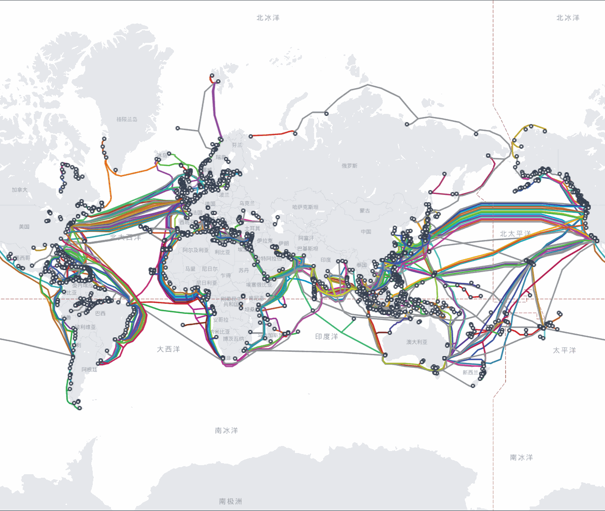

## 互联网的物理基础设施 {#sec-internet-physical}

::: {.callout-note}
### 本章概览

**本章内容**：互联网的物理基础设施如何从 ARPANET 的分布式设计演进为覆盖全球的多层网络

**前置知识**：了解"信息可以通过编码和信号传输"的基本概念即可
:::

---

### 互联网从哪里来

1969 年，美国国防部高级研究计划局（ARPA）建立了一个实验性网络，叫做 **ARPANET**。它连接了加州大学洛杉矶分校、斯坦福研究所、加州大学圣芭芭拉分校和犹他大学的四台计算机，是互联网的前身。

ARPANET 的诞生动机是一个军事问题：冷战期间，美国军方需要一个"不怕核打击"的通信网络。当时的电话网络是中心化的，所有通话都经过总机（交换中心）。如果总机被摧毁，与它相连的所有线路全部瘫痪。Paul Baran 在 1964 年的论文中提出了一个不同的思路：**分布式网络**。网络中没有中心节点，每个节点与多个邻居相连，数据可以从多条路径到达目的地。一条线路被摧毁，数据自动绕行其他路径。

这个设计决策决定了今天互联网的架构：互联网没有"总开关"，没有一台设备、一条线路、一个机构能让整个互联网停止运行。这不是偶然，而是 ARPANET 遗留下来的设计基因。

ARPANET 最初只有这 4 个节点。到 1971 年增长到 15 个节点，1973 年连接了第一个国际节点（挪威和英国）。1983 年，ARPANET 正式采用 TCP/IP 协议（@sec-network-model 会讲解），不同网络之间可以互联，"互联网"（Internet，源自 internetwork，互联的网络）由此得名。1990 年代，万维网（World Wide Web）的发明让互联网从学术工具变成大众基础设施。

### 互联网不是"云"

你每天用微信聊天、看视频、刷网页，这些服务似乎来自一个抽象的"云"。但互联网没有云，只有实实在在的物理设施：埋在地下的光缆、海床上的电缆、机房里的服务器、屋顶上的基站。每一条数据都经过具体的物理线路从一个具体的地方传到另一个具体的地方。

"云"是营销术语，不是技术现实。当你把照片上传到"云端"，照片存储在某个数据中心的硬盘上，通过网络线路传过去。理解互联网的物理身体，是理解网络协议、网络安全、网络性能的基础。

### 海底光缆：各大洲之间的物理连接

互联网是互联的网络，但各大洲之间隔着海洋。连接它们的不是卫星，是**海底光缆**（submarine cable）。全球约 95% 的跨洲数据通过海底光缆传输，卫星通信占比约 5%。

海底光缆的传输容量远大于卫星。一根现代海底光缆可以同时传输数十 Tbps（每秒万亿比特）的数据，而一颗通信卫星的典型容量在数十到数百 Gbps 之间，差两到三个数量级。海底光缆的延迟也更低：光在光纤中的传播速度约 20 万 km/s（光速的 2/3），从上海到洛杉矶约 10,000 km，单程传播延迟约 50 ms。卫星通信需要信号从地面到太空再回地面，地球同步轨道卫星的高度约 36,000 km，信号上行到卫星再下行到地面，一跳延迟约 240 ms。

海底光缆的铺设是一项工程：光缆由多层保护结构包裹（聚乙烯绝缘层、钢丝铠装层、铜导体层、光纤芯），在浅海区域铠装更厚以抵御渔网和船锚，在深海区域可以更细。每段光缆的典型长度为数百到数千公里，两端连接**登陆站**（cable landing station），登陆站是光缆从海里上岸、与陆地网络连接的设施。

{#fig-submarine-cable}

图源：TeleGeography Submarine Cable Map（submarinecablemap.com），CC BY-SA 4.0 授权。

海底光缆的归属和运营方式：光缆由**财团**（consortium）共同投资建设。一条跨太平洋光缆的造价约 3--5 亿美元，单一运营商难以承担，多家电信运营商和互联网公司（如 Google、Meta、Amazon）共同出资，按投资比例分配容量。早期的中美海底光缆（CUCN）由 9 个国家和地区的运营商共同投资约 11 亿美元建设，登陆点包括上海崇明和汕头。全球近 400 条海底光缆在运营，总长度超过 120 万公里。中国大陆的国际海缆登陆站已从传统的 4 个扩展到至少 7 个：青岛（联通）、上海崇明（电信）、上海南汇（联通）、汕头（电信），以及中国移动建成的上海临港站、海南文昌站，还有 2025 年新接入的中国电信海南陵水站。此外，中国联通海南陵水国际海缆登陆站于 2025 年 5 月主体结构封顶，仍在建设中。海南正在成为中国到东南亚的第二通道——从海南到新加坡的海缆距离比从上海出发短约 40%，ALC、SEA-H2X 等新建海缆均以海南为重要登陆点。

光缆会断。渔船拖网、船锚刮蹭、地震海啸都可能损坏光缆。2006 年台湾以南的海底地震一次切断了 6--8 条光缆，导致东亚到北美的通信中断数天。修复方式是派**光缆维修船**到断点附近，把光缆从海床捞起、切断、在两端各接上一段新光缆、重新放下。一次修复耗时数天到数周。

### 运营商网络：互联网的高速公路系统

你家里的网络不是直接连到互联网的。数据从你的设备出发，经过一系列网络才能到达目标服务器。这些网络由**电信运营商**（telecom operator，也叫 ISP，Internet Service Provider）建设和运营。

运营商网络分为三个层级：

#### 接入网：从用户到运营商

**接入网**（access network）是你到运营商之间的连接段。它的技术决定了你家的网络速度和方式：

- **光纤到户**（FTTH，Fiber To The Home）：带宽最高的固定接入方式，中国城市覆盖率超过 90%
- **光纤到楼**（FTTB，Fiber To The Building）：光纤到楼栋，楼内用网线（铜缆）分配到各户。速度受楼内铜缆长度限制
- **移动接入**：手机通过基站接入运营商网络。@sec-last-mile 会详细介绍各种接入技术的参数，@sec-network-model 会讲解无线通信的技术原理

#### 骨干网：运营商的核心网络

**骨干网**（backbone network）是运营商的省际和国际传输网络，由高速光缆和核心路由器组成。骨干网的链路容量通常为 100 Gbps--1 Tbps，是接入网容量的数百到数千倍。

中国的骨干网由三大运营商（电信、联通、移动）各自建设和运营。每家运营商有自己的省际光缆网络和核心路由节点。电信的 163 骨干网和联通的 169 骨干网拥有较长的国际出口资源积累。近年来，中国移动通过自建上海临港、海南文昌国际海缆登陆站，国际海缆自主能力提升（从依赖租用国际海缆到自建登陆站），三家运营商在国际出口资源上正逐步形成更加均衡的格局。骨干网的拓扑通常是网状结构：多个核心节点之间有多条路径，一条链路故障时流量自动绕行。

#### 互联互通：运营商之间的连接

不同运营商的网络是独立建设的。电信用户访问联通网络上的服务器，数据需要从电信网络跨到联通网络。这个跨网连接点叫做**互联网交换点**（Internet Exchange Point，IXP）。

IXP 的作用是让不同网络直接互联，减少绕行。如果电信和联通在本地没有 IXP，电信用户访问联通服务器时，数据可能要绕到另一个城市的交换点再回来，增加延迟。中国主要城市设有**国家级交换中心**（NAP，Network Access Point），运营商在此互联。

互联互通的质量影响跨网访问速度。你可能在电信宽带下访问联通机房里的网站时发现高峰期跨网延迟可达同网延迟的数倍，原因就是两个运营商之间的互联带宽不足，高峰期出现拥塞。

### 数据中心：集中运行服务器的设施

你访问的每个网站、使用的每个在线服务，背后都运行在**数据中心**（data center）里。数据中心是集中放置服务器和网络设备的建筑。

#### 服务器与网络设备

数据中心里有成千上万台**服务器**（server），每台服务器是一台专门设计的高性能计算机：多核 CPU、大容量内存、多块硬盘或 SSD，安装在标准尺寸的机架（19 英寸宽，高度以 U 为单位，1 U = 4.445 cm）上。一个机架通常放置 30--50 台服务器，一个数据中心可以容纳数千到数十万个机架。

服务器之间通过**交换机**和**路由器**连接。数据中心内部网络的聚合带宽远高于外部连接：每台服务器到交换机的典型链路速率为 10--100 Gbps，而数据中心到外部互联网的总出口带宽通常也是 10--100 Gbps——数千台服务器的内部流量共享这一出口，外部连接是瓶颈。

#### 供电与散热

一台典型服务器的功耗约 300--500 W，一个容纳 10 万台服务器的数据中心总功耗约 30--50 MW，相当于一个小城市的用电量。数据中心的运营成本中，电费占 30--50%。

电力主要用于两方面：驱动服务器运行（约 40--50% 的电力）和散热（约 30--40%），其余用于配电损耗、照明和网络设备等。服务器持续发热，如果温度过高，硬件会降频甚至损坏。数据中心使用**精密空调**（CRAC，Computer Room Air Conditioning）控制温度，先进的数据中心采用**冷热通道隔离**（hot aisle/cold aisle containment）：机架正面排出的热空气和背面需要的冷空气分别走不同通道，避免混合，提高散热效率。

电力供应必须不间断。数据中心配备**UPS**（Uninterruptible Power Supply，不间断电源）：电池组在市电中断时立即接管供电，维持到柴油发电机启动。柴油发电机储备数小时到数天的燃料，确保长时间停电时数据中心仍能运行。

#### 冗余与容灾

数据中心的设计原则是**冗余**（redundancy）：任何单点故障都不应导致服务中断。

- **电力冗余**：多路独立市电供电、多套 UPS、多台发电机。行业标准将冗余分为 T1--T4 四个等级，T4 数据中心的任何设备维护或故障都不影响运行
- **网络冗余**：多条独立的上联链路连接不同的运营商。一条链路中断，流量自动切换到备用链路
- **地理冗余**：同一服务部署在不同城市或不同洲的数据中心。一个数据中心因灾害（地震、洪水、火灾）不可用时，其他数据中心继续服务。2021 年法国斯特拉斯堡的数据中心火灾，烧毁了数万台服务器，但使用多数据中心部署的客户在几分钟内切换到了其他站点

### 内容分发网络：让内容离用户更近

你在北京访问一个部署在美国的网站，数据要跨越太平洋，单程传播延迟约 70 ms，一个网页的完整加载可能需要数百毫秒到数秒。如果网站的服务器就在北京，延迟可以降到 5--10 ms。

**内容分发网络**（Content Delivery Network，CDN）的思路是：把内容复制到离用户更近的地方。CDN 在全球部署大量**边缘节点**（edge server），每个节点缓存热门内容的副本。用户请求内容时，CDN 将请求路由到距离最近的边缘节点，从那里返回缓存的内容，而不是每次都从源服务器（可能在另一个洲）获取。

CDN 的效果：全球延迟从数百毫秒降到数十毫秒，视频流媒体、网页加载、软件下载等场景受益。全球流量排名前 1000 的网站中，超过 60% 使用了 CDN（Cloudflare、Akamai、阿里云 CDN 等是主要的 CDN 服务商）。

CDN 引入了一个概念：**边缘计算**（edge computing）。不仅内容可以放在离用户近的地方，计算也可以。对延迟敏感的应用（如在线游戏的物理计算、自动驾驶的实时决策）把计算任务放在边缘节点执行，而不是每次都把数据传到远端数据中心。

### 根域名服务器：互联网地址簿的入口

当你访问 `baidu.com` 时，计算机需要知道 `baidu.com` 对应的服务器 IP 地址。这个"域名到 IP 地址"的翻译由 **DNS**（Domain Name System，域名系统）完成。@sec-application-layer 会详细讲解 DNS 的工作流程，这里只讲它的物理基础设施。

DNS 是一个层次系统，最顶层是**根域名服务器**（root name server）。全球有 13 组根服务器，编号 A 到 M。为什么是 13 组？DNS 协议最初设计时，一个 DNS 响应报文能容纳的根服务器信息受 512 字节限制，13 组服务器的地址信息刚好能放进这个限制内。IPv6 和扩展机制出现后这个限制已不再适用，但 13 组的设置沿用了下来。

13 组是逻辑组数，不是物理机器数。每组根服务器使用 **Anycast** 技术：同一个 IP 地址部署在多个物理位置，路由器自动将请求导向最近的一个。全球根服务器的物理实例总数超过 1700 个，分布在各大洲。运营者包括 ICANN、Verisign、美国国防部、NASA、CERN 等。中国也部署了多组根服务器的镜像实例。

### 最后一公里：从运营商到你的设备 {#sec-last-mile}

"最后一公里"（last mile）指从运营商的接入设备到你家中或手中设备的这段连接。它是整个互联网链路中带宽最窄、技术最多样的一段。

#### 固定接入

- **光纤到户**：光纤直接到你家，带宽 100 Mbps--10 Gbps（GPON/XGS-PON 技术）。中国城市覆盖率超过 90%
- **网线接入**：从楼栋机房用网线（双绞线，Cat5e/Cat6）拉到你家，带宽受网线长度限制，典型 100--1000 Mbps，最长 100 m
- **电话线接入**：利用已有的电话线传输数据（DSL 技术），带宽 10--100 Mbps，正在被光纤取代

#### 无线接入

- **移动网络**：手机通过基站接入。4G 基站的典型覆盖半径城区 1--3 km、郊区 5--10 km；5G 使用更高频段，覆盖半径更小（城区 100--300 m），需要更密集的基站部署。中国 5G 基站数量超过 400 万个
- **Wi-Fi**：覆盖家庭和办公场所内部，典型覆盖半径 10--50 m。Wi-Fi 是接入网的延伸：数据从你的设备经 Wi-Fi 到路由器，再经光纤到运营商
- **卫星接入**：低轨道卫星星座（如 Starlink，轨道高度约 550 km）为地面网络难以覆盖的区域（海洋、沙漠、偏远乡村）提供接入。Starlink 目前在轨卫星超过 8000 颗，典型下行速率 50--200 Mbps，延迟 25--60 ms（低于地球同步轨道卫星的 240 ms）

最后一公里决定了你的实际上网速度。即使骨干网有 1 Tbps 的容量，如果你的光纤只有 100 Mbps 带宽，你的速度上限就是 100 Mbps。运营商销售的"100M 宽带"指的是接入网带宽，不是你到每个网站的端到端速度。

### 本章小结

互联网起源于 1969 年的 ARPANET，其分布式设计（没有中心节点，数据可以绕行）决定了今天互联网没有单点故障的架构。互联网的物理基础设施包括海底光缆（跨洲数据传输的主要通道，全球近 400 条在运营）、运营商网络（接入网连接用户，骨干网连接城市，IXP 连接不同运营商）、数据中心（集中运行服务器，需要大量电力和散热，依靠冗余保证可用性）、CDN（把内容复制到离用户更近的边缘节点以降低延迟）、根域名服务器（DNS 层次系统的顶层，13 组逻辑根服务器使用 Anycast 技术在全球部署了超过 1700 个物理实例）。最后一公里是从运营商到用户设备的连接，光纤到户和移动网络是当前两种主要接入方式。

::: {.callout-note}
### 在生活中

你家里办宽带时，运营商师傅拉的那根光纤就是"最后一公里"，它把你家连接到小区机房，再通过骨干网接入互联网。你用手机开热点给电脑上网，手机就是你的"最后一公里"。
:::

::: {.callout-tip}
### 延伸阅读

- Andrew Blum《Tubes: A Journey to the Center of the Internet》第 3-5 章 —— 探访海底光缆铺设过程和数据中心的内部结构，从工程视角建立"互联网有实体"的直观认知
:::