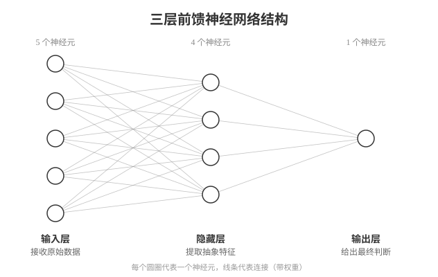

## 人工智能与量子计算 {#sec-ai-and-quantum}

::: {.callout-note}
### 本章概览

**本章内容**：机器学习如何从人写规则经由神经网络走向从数据中学会生成的大语言模型

**前置知识**：理解算法是解决特定问题的一系列明确步骤，GPU 擅长并行处理大量相同类型的计算任务
:::

---

### 传统程序的边界

前面四章讲了软件如何被创造、数据如何组织、程序如何运行在云端。这些软件有一个共同特点：程序员把解决问题的规则写成代码，计算机按规则执行。垃圾邮件过滤器里写的是"如果邮件包含'免费领取'且发件人不在通讯录中，标记为垃圾邮件"；导航软件里写的是"从起点到终点，选择总距离最短的路径"。

人先想清楚规则，再把规则翻译成代码，计算机按规则执行。这种做法叫做**规则驱动**（rule-driven）的程序。对规则明确的问题，这类程序有精确算法，排序、搜索、路径规划都是。

但有些问题，人写不出规则。人脸识别：你能认出朋友的脸，但你说不出"两眼间距 6.2 厘米、鼻梁倾斜角 12°"这样的规则。你认识这张脸，是因为你见过很多脸，大脑自动学会了区分。语音识别、机器翻译、自动驾驶，这些问题的共同特征是：输入和输出之间的关系太复杂，无法用有限条规则穷尽。

**机器学习**（machine learning）换了一种思路：不写规则，给数据。程序从数据中自动找出模式，用找出的模式做判断。垃圾邮件过滤器不用人写规则，而是给它看 1 万封已标记的邮件，它自己学会哪些特征预示着垃圾邮件。

#### 三种学习方式

机器学习不是一种方法，而是三种思路的统称，区别在于训练数据的形式：

**监督学习**（supervised learning）：训练数据有标注，每个输入对应一个正确输出。6 万张手写数字图片，每张标注了"这是 3""这是 7"，网络从标注中学习输入到输出的映射。垃圾邮件过滤、图像识别、语音转文字，都用监督学习。

**无监督学习**（unsupervised learning）：训练数据没有标注，程序自行发现数据中的结构。给网络一批用户的购物记录，它可能发现"买婴儿用品的人经常也买纸尿裤"，这种关联没有人事先告诉它。客户分群、异常检测、数据降维，都用无监督学习。

**强化学习**（reinforcement learning）：没有标注数据，但有一个"奖励信号"。程序采取一个动作，环境返回一个分数表示这个动作好不好，程序调整策略以获得更高的累计奖励。下围棋的 AlphaGo 就用强化学习：赢了加分、输了扣分，通过数百万次自我对弈学会落子策略。自动驾驶、游戏 AI、机器人控制，都用强化学习。

三种方式解决不同类型的问题。本章重点讲监督学习，因为它是最成熟、应用最广的方式，也是理解神经网络和大语言模型的基础。

### 神经网络：从数据中学习模式

机器学习有多种模型，目前效果最好、应用最广的是**神经网络**（neural network）。为什么是它？在神经网络流行之前，机器学习用的是决策树、支持向量机等模型，这些模型在特征少、数据量小时效果不错，但面对图像、语音、自然语言这类高维输入（一张 28×28 的手写数字图片有 784 个像素，一段 1 秒语音有 16000 个采样点），它们难以自动提取有效特征，需要人手工设计特征提取器。神经网络的优势在于：给定足够的数据和层数，它可以自动从原始输入中逐层提取特征，不需要人手工设计。

神经网络的设计受大脑神经元启发：大脑中，每个神经元接收来自其他神经元的信号，信号强度超过阈值时，这个神经元向下游发送信号。神经网络用数学结构模拟这个过程。

一个神经网络由多层**神经元**（neuron，也叫节点）组成。每个神经元做一件事：把输入乘以权重、求和、加偏置、通过激活函数输出。写成公式：$y = f(w_1 x_1 + w_2 x_2 + \cdots + w_n x_n + b)$，其中 $x$ 是输入，$w$ 是**权重**（weight），$b$ 是**偏置**（bias），$f$ 是**激活函数**（activation function）。权重决定每个输入的重要程度，偏置调整触发门槛，激活函数引入非线性（没有它，多层网络等价于单层）。

{#fig-neural-network}

网络分三层：

- **输入层**：接收原始数据。识别 28×28 像素的手写数字，输入层有 784 个神经元，每个对应一个像素的灰度值
- **隐藏层**：在输入和输出之间，逐层提取更抽象的特征。第一隐藏层可能识别笔画边缘，第二隐藏层可能识别笔画组合（横、竖、弯），第三隐藏层可能识别数字部件（圆圈、竖线）
- **输出层**：给出最终判断。识别 0-9 十个数字，输出层有 10 个神经元，分别表示"是 0""是 1"……"是 9"的概率

权重和偏置不是人设定的，是网络从数据中学出来的。这是神经网络区别于传统程序的地方：人定义网络的结构（多少层、每层多少神经元），网络自己学习连接的强度（权重和偏置）。

不同任务需要不同的网络结构。**卷积神经网络**（Convolutional Neural Network，CNN）在隐藏层中加入卷积运算，让网络用同一组权重扫描整张图像，适合图像识别。**循环神经网络**（Recurrent Neural Network，RNN）让隐藏层有反馈连接，能记住前几个时间步的信息，适合处理语音和文本这类序列数据。但 RNN 有一个缺陷：当序列很长时，早期信息的信号在反复传递中衰减，网络"记不住"开头的内容。这个缺陷直接催生了 Transformer 架构，后文会讲到。

### 训练与推理：学一次，用很多次

神经网络的**训练**（training）过程如下：

1. 准备**训练数据**（training data）：已标注的样本，如 6 万张手写数字图片，每张标注了"这是 3""这是 7"
2. 把一张图片送入网络，网络输出预测结果
3. 比较**预测**和**标注**，计算**损失**（loss）：预测与正确答案的差距有多大
4. 用**反向传播**（backpropagation）算法计算每个权重和偏置对损失的贡献，然后微调它们，使损失变小。反向传播的原理是链式法则：从输出层往回逐层计算损失对每个权重的偏导数，告诉网络"哪个权重的调整对减小损失最有效"
5. 对所有训练样本重复上述过程，直到损失不再下降

训练的计算量随参数量和数据量增长。@sec-gpu 讲过，GPU 有数千个核心，擅长并行处理。训练神经网络需要大量相同的矩阵乘法运算，GPU 的并行能力使训练速度比 CPU 快数十倍。一个在 CPU 上训练需要数周的模型，在 GPU 上可能只需数小时。

训练完成后，网络学到了一组权重和偏置。**推理**（inference）是把新数据送入这组固定的权重，得到预测结果。推理不需要再调整权重，计算量约为训练的 1/100 到 1/10。你手机上的人脸识别、语音助手，都在做推理。训练在云端完成，推理在本地执行。

训练和推理的关系：训练是"学习"，花大量时间和算力做一次；推理是"应用"，用学到的知识快速判断。训练产出的权重文件通常为数百 MB 到数十 GB，推理时只需加载这个文件，不需要重新训练。

前面讲的训练和推理，模型规模通常在百万到亿级参数。当参数规模扩大到千亿级、训练数据扩大到数万亿词时，发生了什么？

### 大语言模型：预测下一个词

2022 年底 ChatGPT 发布后，**大语言模型**（Large Language Model，LLM）进入公众视野。它的参数规模在千亿到万亿级，2020 年的 GPT-3 有 1750 亿参数，2024 年的 DeepSeek-V3 总参数 6710 亿（混合专家（Mixture of Experts，MoE）架构，每次推理仅激活约 370 亿），GPT-4 等模型的参数量未公开，业界估计在万亿级。

LLM 的训练目标只有一个：**预测下一个词**。给它一段文本"今天天气很好，我们出门"，它预测下一个词可能是"散步""爬山""野餐"。这个目标简单，但要做到准确，模型必须理解语法（"出门"后面跟动词）、语义（天气好→户外活动）、世界知识（"巴黎是法国的___"→"首都"）。

训练数据来自互联网上的文本：网页、书籍、论文、代码，总量达数万亿词。模型从中学习语言的统计规律，不是记忆原文，而是学习词与词之间的关联模式。当参数量达到数百亿甚至数千亿、训练数据达到数万亿词时，模型展现出的能力超过"预测下一个词"这个目标本身：它能写文章、解数学题、翻译、写代码、进行多轮对话。这种训练目标简单但涌现出复杂能力的现象，叫做**涌现**（emergence）。涌现的机制目前尚无完整理论解释，经验观察表明：参数量超过某个阈值（通常在数百亿级）后，模型突然获得在训练目标中未显式要求的能力，如逻辑推理和指令遵循。

参数越多、训练数据越多，模型能力通常越强，但训练成本也越高。GPT-3 的训练需要数千块 GPU 连续运行数周，总计算量约 3.64 × 10²³ 次浮点运算，电费以百万美元计。

#### Transformer 与自注意力

LLM 的架构是 **Transformer**，2017 年由 Google 的论文《Attention Is All You Need》提出。在此之前，处理文本的主流架构是 RNN，但 RNN 的长距离依赖问题限制了它处理长文本的能力。Transformer 用一种新机制替代了 RNN 的递归结构。

这个机制叫**自注意力**（self-attention）：处理每个词时，模型可以"关注"输入序列中的所有其他词，计算它们与当前词的关联程度，据此加权汇总信息。处理"银行"这个词时，如果上下文是"他去银行取钱"，自注意力会让模型关注"取钱"，从而理解这里的"银行"是金融机构而非河岸。与 RNN 逐词传递信息不同，自注意力让每个词直接与序列中所有词建立联系，距离不再是障碍。

#### 微调与对齐

训练 LLM 分为两个阶段。第一阶段是**预训练**（pre-training）：用数万亿词的互联网文本训练模型预测下一个词，模型获得语言能力。但预训练后的模型只是"续写机器"，给它"如何制作炸弹"它会续写下去，不会拒绝。

第二阶段是**对齐**（alignment）：让模型的行为符合人类期望。方法之一是**基于人类反馈的强化学习**（Reinforcement Learning from Human Feedback，RLHF）：人类标注员对模型的不同回答打分，用这些分数训练一个奖励模型，再用强化学习让 LLM 优化其输出以获得更高分数。经过 RLHF，模型学会了在有害请求下拒绝回答、在不确定时承认不知道、在对话中保持有帮助且无害的态度。ChatGPT 之所以能对话而非单纯续写，就是因为经过了这一步对齐。

### 大语言模型的幻觉、偏见与能耗

LLM 有三类局限。

**幻觉**（hallucination）：LLM 生成语法正确、逻辑连贯但与事实不符的内容。问"林徽因的代表作有哪些"，它可能编造出不存在的作品。原因在于 LLM 的本质是预测下一个词，它生成统计上最可能的文本，不验证事实。它没有可以查询的知识库，只有从训练数据中学到的统计模式。当训练数据中相关信息不足，或者问题本身有歧义时，模型会编造出语法正确但与事实不符的回答。

**偏见**（bias）：训练数据来自互联网，互联网上的文本带有社会偏见，包括性别偏见、种族偏见、文化偏见。模型从这些数据中学习，会复现甚至放大这些偏见。如果训练数据中"护士"多与女性共现、"工程师"多与男性共现，模型生成的文本也会延续这种关联。消除偏见需要在数据筛选、模型训练、输出过滤等多个环节干预，且无法完全消除。

**能耗**：训练千亿参数级模型消耗数千兆瓦时电力。一项 2024 年的研究估计，训练一个千亿参数级模型的碳排放约 300--500 吨二氧化碳当量，相当于约 60 辆汽车一年的排放量。推理的能耗同样不可忽视。全球每天有数亿次 AI 对话请求，每次推理消耗数十到数百毫秒的 GPU 时间，这些推理的累计能耗与训练能耗处于同一数量级。AI 的环境成本是它被广泛部署前必须正视的问题。

---

### 为什么需要量子计算

到目前为止，我们讨论的所有计算都基于经典模型：比特要么是 0 要么是 1，寄存器、内存、硬盘中的每个存储单元在任一时刻只处于一种确定状态。经典计算机能解决排序、搜索、加密、解密等大量问题，但对某些问题，经典算法所需的计算步数随输入规模指数增长。

大数分解是一个例子：把一个 2048 位的整数分解为质数的乘积，经典算法需要尝试的因子数量约为 $2^{1024}$，即使每秒尝试 1 万亿个因子，也需要数十亿年。这类问题的解空间随输入规模指数膨胀，经典计算机只能一个一个尝试，无法在有限时间内遍历。

**量子计算**（quantum computing）试图用量子力学的性质来加速这类问题。它不是在所有问题上都更快，而是对解空间指数膨胀的特定问题，利用量子叠加同时探索多个分支，再通过量子干涉让正确答案的概率增大、错误答案的概率减小，从而比经典算法更快地找到答案。

### 量子比特：0 和 1 之外的第三种状态

经典比特在任一时刻要么是 0 要么是 1。**量子比特**（qubit）有一种经典比特不具备的性质：**叠加**（superposition）。

一个量子比特可以同时处于 0 和 1 的叠加态。用数学表示：$|ψ\rangle = α|0\rangle + β|1\rangle$，其中 $|0\rangle$ 和 $|1\rangle$ 是两种基本状态（对应经典比特的 0 和 1），$α$ 和 $β$ 是复数，$|α|^2 + |β|^2 = 1$。$|α|^2$ 是测量时得到 0 的概率，$|β|^2$ 是得到 1 的概率。例如 $α = β = 1/\sqrt{2}$ 时，测量得到 0 和 1 的概率各为 50%，量子比特处于"一半是 0、一半是 1"的叠加态。

测量之前，量子比特处于叠加态，不等于 0 也不等于 1。测量时，它随机坍缩为 0 或 1，坍缩为 0 的概率是 $|α|^2$，坍缩为 1 的概率是 $|β|^2$。测量后叠加态消失，量子比特变成经典比特。

两个量子比特可以形成**纠缠**（entanglement）：两个比特的状态无法独立描述，测量其中一个会瞬间确定另一个的状态，无论它们相距多远。纠缠是量子计算加速的另一个资源。

$n$ 个经典比特只能表示 $2^n$ 种状态中的一种，$n$ 个量子比特可以同时处于 $2^n$ 种状态的叠加。50 个量子比特的叠加态包含 $2^{50} \approx 10^{15}$ 种状态，这个数字超过了一块 1 TB 硬盘能存储的状态数。量子算法利用叠加和纠缠，对这 $2^n$ 种状态同时进行运算，再通过干涉提取结果：设计量子电路使得正确答案对应的概率幅相互叠加增强，错误答案对应的概率幅相互抵消减弱，测量时以高概率得到正确答案。

### 量子计算能做什么、不能做什么

量子计算不是"更快的计算机"。它不能加速所有问题，只对特定类型的问题有指数级加速：

- **能加速的问题**：大数分解（将大合数分解为质数的乘积）、量子化学模拟（模拟分子和化学反应）、某些优化问题。这些问题有一个共同特征：经典算法需要搜索的解空间随输入规模指数增长，量子算法利用叠加态同时探索多个分支
- **不能加速的问题**：排序、搜索单个数据库、大多数日常计算任务。对于这些问题，量子计算机不比经典计算机快

大数分解的量子加速有实际意义。@sec-computer-security 讲到的 RSA 加密，安全性依赖于"大数分解在经典计算机上不可行"这一事实。2048 位的 RSA 密钥，经典计算机需要数十亿年才能分解；足够大的量子计算机运行 **Shor 算法**（Peter Shor 于 1994 年提出，解决了大数分解的量子算法问题），理论上可在数小时内完成。这意味着一旦实用化的量子计算机建成，现有的 RSA 加密将不再安全。

但"一旦"可能还很远。2024 年，已宣布的通用门型量子处理器达到 1000+ 量子比特（如 IBM Condor 的 1121 个、Atom Computing 的 1225 个），但**量子纠错**（quantum error correction）尚未解决。量子比特的相干时间在微秒到毫秒量级，环境干扰（温度波动、电磁辐射）会导致计算错误，需要大量额外的量子比特来纠正错误。运行 Shor 算法分解 2048 位 RSA 密钥，估计需要数百万个物理量子比特。从 1000 到数百万，还有数量级的工程差距。

当前的量子计算机采用几种物理实现方式：超导电路（IBM、Google 的路线，量子比特在接近绝对零度的超导环中实现）、离子阱（用电磁场束缚单个离子作为量子比特）、光量子（用光子的偏振态编码量子比特）。每种方式各有工程挑战，尚无哪种路线被公认为最终方案。

应对量子计算对加密的威胁，密码学界已经在研究**后量子密码**（post-quantum cryptography）：设计在量子计算机上仍然安全的加密算法。2024 年，NIST（美国国家标准与技术研究院）发布了第一批后量子密码标准。过渡已经开始，即使量子计算机还未实用化，加密体系也需要提前升级，因为现在加密的数据，未来可能被量子计算机解密。

### 本章小结

传统程序由人编写规则，计算机执行规则；机器学习由人提供数据，程序从数据中学习规则。机器学习分为监督学习、无监督学习、强化学习三种方式。神经网络是机器学习最常用的模型，通过训练调整权重，推理时用学到的权重做判断。大语言模型以预测下一个词为目标，从数万亿词的文本中学习语言的统计规律，涌现出对话、写作、推理等能力，经过对齐训练后能遵循人类期望，但存在幻觉、偏见、能耗三类局限。量子计算利用量子比特的叠加和纠缠，对解空间指数膨胀的特定问题（如大数分解）有指数级加速，但对大多数日常计算无优势。量子计算尚处实验室阶段，但对现有加密体系的潜在威胁已推动后量子密码标准的制定。

::: {.callout-note}
### 在生活中

ChatGPT、文心一言等 AI 助手，底层是经过对齐训练的大语言模型；手机相册的"人脸识别"、购物 App 的"猜你喜欢"，是监督学习的应用。量子计算目前仍处于实验室阶段，尚未进入日常使用。
:::

::: {.callout-tip}
### 延伸阅读

- Stuart Russell & Peter Norvig《Artificial Intelligence: A Modern Approach》第 1-2 章 —— AI 领域的经典教材，建立对人工智能的系统理解
- Michael Nielsen《Neural Networks and Deep Learning》（在线免费） —— 从零开始理解神经网络与深度学习的原理
- John Preskill《Quantum Computing in the NISQ era and beyond》 —— 量子计算现状与前景的综述，适合理解当前技术的实际能力与局限
:::